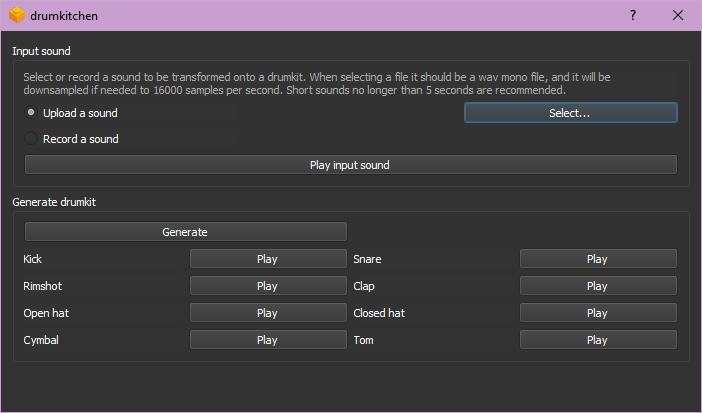

# drumkitchen

Unfinished tool to generate drumkits from given input sounds using the AutoEncoder model from the [DDSP library](https://github.com/magenta/ddsp). The trained models are also included in this repository, feel free to change them for your own.

This project was developed in the frame of the CMC course of the Sound and Music Computing Masters at Universitat Pompeu Fabra.

## How to run

Since PyQt5 is used for this interface, it only compiles with Python 3.5 and 3.6. Make sure you have one of these versions of Python installed, and run your commands specifying the version.  
After installing all the requirements, create the environment by running the following command:  
`py -3.6 -m venv fbsenv` (or 3.5 if you are using that version)  
Then activate it with this command:  
`call fbsenv/scripts/activate.bat`  
Then you should be able to run the program running:  
`py -3.6 -m fbs run`

## Interface

This is the current interface:

In order to use this program, select a ‘.wav’ input file with the Select... button, and thereafter press Generate. A prompt will ask you to choose the folder where the new 8 files will be saved (‘kick.wav’, ‘snare.wav’,...). Then you can play them or use the saved files.

## TODO

I apologize in advance for the state of this repo since this is a work in progress (so a lot of things are still missing). I will keep working on it, and these are a few of the next things that I plan to be implement:
- Record a sound
- Multithreading (now each call blocks so the application freezes)
- Testing environment
- Application packaging (so it can be installed and run way easier!)
- UI adjustments, better sound representation (plots), ...
